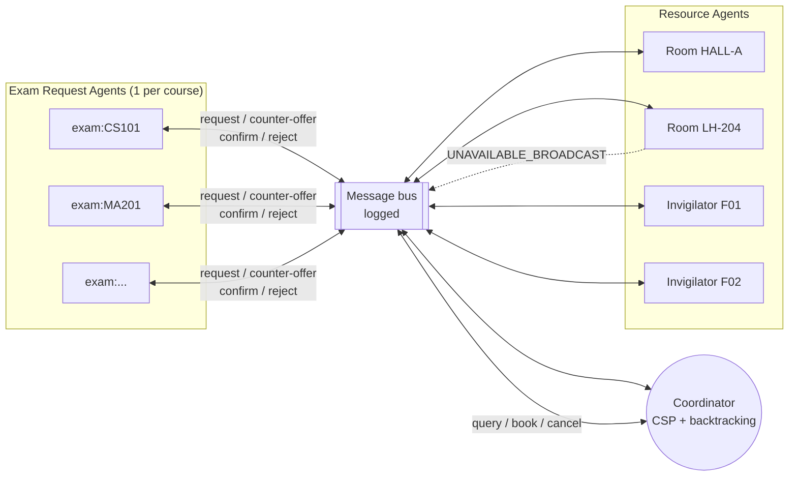
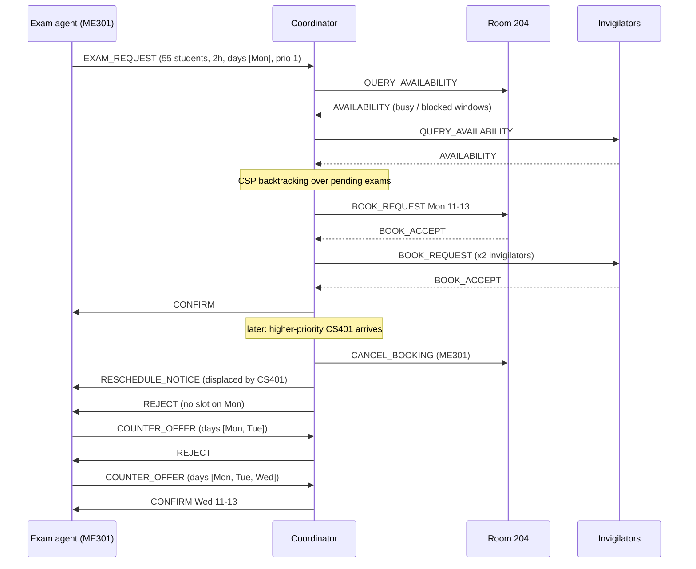

# Multi-Agent University Exam Scheduling & Conflict Resolution

> Exam-request, resource and coordinator agents negotiate to build a conflict-free exam timetable. When a room or faculty member suddenly becomes unavailable, they replan.

This is a decentralized exam scheduler. Three kinds of agent hold their own state, talk only through messages, and cooperate to build a timetable that satisfies every hard constraint. The Coordinator solves the scheduling problem as a **Constraint Satisfaction Problem (CSP)** using **backtracking search** with the **MRV (most-constrained-exam-first)** heuristic and **forward checking**. When a Resource Agent broadcasts an unplanned outage, the Coordinator re-searches **only the affected exams**.

**No dataset is needed.** Scenarios are either hand-written (small and easy to explain) or generated from a seed (reproducible random universities).

---

## Contents

1. [Quick start](#quick-start)
2. [Why multi-agent?](#why-multi-agent)
3. [Architecture](#architecture)
4. [The agents (with PEAS)](#the-agents)
5. [Message protocol](#message-protocol)
6. [CSP formulation & search](#csp-formulation--search)
7. [Environment classification](#environment-classification)
8. [Demo scenarios](#demo-scenarios)
9. [Frontend guide](#frontend-guide)
10. [CLI, API & tests](#cli-api--tests)
11. [Project structure](#project-structure)
12. [Design decisions & limitations](#design-decisions--limitations)

---

## Quick start

Requirements: Python 3.10+.

```bash
python -m venv .venv && source .venv/bin/activate   # Windows: .venv\Scripts\activate
pip install -r requirements.txt

# 1) Web UI
uvicorn server:app --reload
#    open http://127.0.0.1:8000

# 2) Terminal: run every demo scenario and print the timetables
python -m exam_scheduler --scenario all

# 3) Tests (stdlib unittest, no extra packages)
python -m unittest -v
```

The scheduling engine (`exam_scheduler/`) uses only the standard library. FastAPI and uvicorn are needed only for the web UI.

---

## Why multi-agent?

Exam scheduling is not naturally centralized. Rooms, invigilators and exam requests are separate pools of information that change independently and in real time: a room goes under maintenance, a faculty member falls sick, a request comes in late. A single scheduler that recomputes everything from scratch on every change doesn't scale, and it doesn't match how university offices actually work, where different departments each hold part of the puzzle and negotiate. In this model:

- each **Resource Agent** is the only owner of the true state of its room or invigilator,
- each **Exam Request Agent** knows only its own exam and negotiates for it,
- the **Coordinator** sees the world only through queries and broadcasts, so its view is partial and can be stale.

---

## Architecture



A typical negotiation, including a rejection, a counter-offer and a later disruption:



### Simulation loop

Time advances in discrete **ticks**. Each tick:

1. scheduled or injected **disruption events fire**, and the affected Resource Agent broadcasts unprompted;
2. **Exam Request Agents** act: they submit requests, counter-offer after a rejection, or declare a hard conflict;
3. **Resource Agents** process any asynchronous messages;
4. the **Coordinator** reads its inbox (requests, counter-offers, broadcasts) and, if anything is pending, runs a **planning round**.

The simulation is *done* when no exam is still negotiating, no messages are queued, and no scheduled events remain.

---

## The agents

### 1. Exam Request Agent: `exam_scheduler/agents/exam_request.py`

One per course exam.

| Holds | Actions |
|---|---|
| course code, enrolled students, duration, priority, student groups | `EXAM_REQUEST`: room-size need + duration + window |
| an ordered list of **windows**: the preferred days first, then alternates | `COUNTER_OFFER`: widens its window after a `REJECT` |
| the set of **other exams its student groups also take** (overlap risk) | `HARD_CONFLICT`: sent when no alternative window is left |
| optional soft preference: day/hour and room | reacts to `CONFIRM` / `RESCHEDULE_NOTICE` |

| PEAS | |
|---|---|
| **P**erformance | gets a valid slot inside an acceptable window, as close to its preference as possible |
| **E**nvironment | the Coordinator's responses; its own cohort, duration, clashing exams |
| **A**ctuators | `EXAM_REQUEST`, `COUNTER_OFFER`, `HARD_CONFLICT` |
| **S**ensors | `CONFIRM`, `REJECT`, `RESCHEDULE_NOTICE` |

### 2. Resource Agents: `exam_scheduler/agents/resource.py`

The case study allows either bundled room+invigilator agents or separate ones. This implementation uses **separate** agents: a `RoomAgent` per room and an `InvigilatorAgent` per faculty member. Invigilators are shared across rooms, so the "no invigilator double-booked" constraint actually matters.

| Holds | Actions |
|---|---|
| capacity (rooms), a **live timetable** of bookings, a list of **blocked windows** (maintenance, sickness) | answers `QUERY_AVAILABILITY` with free/busy |
| optional *flakiness*: a probability that a booking is refused for reasons the Coordinator could not observe | `BOOK_ACCEPT` / `BOOK_REJECT` (checks its **true** state and capacity) |
| | `CANCEL_BOOKING` → `CANCEL_ACK` |
| | **unprompted** `UNAVAILABLE_BROADCAST`, e.g. *"Room 204 unavailable Thu 12-14, wiring repair"* or *"F07 sick, Tue"* |

| PEAS | Room | Invigilator |
|---|---|---|
| **P** | never double-booked or over capacity | never in two exams at once |
| **E** | own timetable, facilities events | own duty roster, leave/sickness |
| **A** | availability replies, accept/reject, broadcast | same |
| **S** | query/book/cancel messages, maintenance alerts | query/book/cancel messages, HR notices |

### 3. Scheduler / Coordinator Agent: `exam_scheduler/agents/coordinator.py`

Single and central.

| Holds | Actions |
|---|---|
| the **master timetable** (committed assignments) | queries Resource Agents, then runs the **CSP backtracking search** |
| the **pending queue** of unresolved requests | books room + invigilators; **unwinds** partial bookings if any resource refuses |
| **beliefs** about each resource (last query plus broadcasts), which may be stale | resolves contention by **priority**: ordering, fallback and **bumping** a lower-priority exam |
| unresolved exams with reasons | reacts to broadcasts with **local repair**: swaps the invigilator, or re-searches only the affected exams |

| PEAS | |
|---|---|
| **P** | number of exams placed with **zero** hard-constraint violations; few messages; minimal disruption when replanning |
| **E** | partially observable, dynamic, stochastic, multi-agent |
| **A** | `QUERY_AVAILABILITY`, `BOOK_REQUEST`, `CANCEL_BOOKING`, `CONFIRM`, `REJECT`, `RESCHEDULE_NOTICE` |
| **S** | `EXAM_REQUEST`, `COUNTER_OFFER`, `HARD_CONFLICT`, `AVAILABILITY`, `BOOK_ACCEPT/REJECT`, `UNAVAILABLE_BROADCAST` |

---

## Message protocol

Every message goes through `MessageBus` (`exam_scheduler/messages.py`) and is logged; the UI shows the full log.

| Type | From → To | Mode | Meaning |
|---|---|---|---|
| `EXAM_REQUEST` | Exam → Coordinator | async | students, duration, allowed days, groups, clashing exams, priority, preference |
| `COUNTER_OFFER` | Exam → Coordinator | async | same payload with a **wider** window |
| `HARD_CONFLICT` | Exam → Coordinator | async | no alternatives left; carries the reason |
| `CONFIRM` | Coordinator → Exam | async | room + interval + invigilators (also sent after an invigilator swap) |
| `REJECT` | Coordinator → Exam | async | could not place in the current window; carries a diagnosed reason |
| `RESCHEDULE_NOTICE` | Coordinator → Exam | async | your booking was lost (disruption or bump) and you have been re-queued |
| `QUERY_AVAILABILITY` / `AVAILABILITY` | Coordinator ↔ Resource | request/response | free/busy and blocked windows |
| `BOOK_REQUEST` / `BOOK_ACCEPT` / `BOOK_REJECT` | Coordinator ↔ Resource | request/response | the resource checks its *true* state and can refuse |
| `CANCEL_BOOKING` / `CANCEL_ACK` | Coordinator ↔ Resource | request/response | release a booking (unwind, bump, replan) |
| `UNAVAILABLE_BROADCAST` | Resource → all listeners | async, **unprompted** | sudden unavailability window plus the bookings it dropped |

Async messages are read on the recipient's next turn. Request/response is used where the Coordinator needs an answer before it can continue, like an RPC over the bus.

---

## CSP formulation & search

Implemented in `exam_scheduler/csp.py`.

**Variables:** the exams currently in the Coordinator's pending queue.
**Domain of an exam:** every `(room, day, start-hour)` inside its allowed days, where the exam fits within the day's hours (09:00-17:00 by default, hour granularity).

**Hard constraints**

| # | Constraint | Kind | How it is enforced |
|---|---|---|---|
| C1 | room capacity ≥ enrolled students | unary | filtered from the domain before search |
| C2 | no room double-booked | binary (all pairs) | forward checking |
| C3 | no invigilator double-booked | global/resource | enough free invigilators needed: `ceil(students/50)`, minimum 1 |
| C4 | no student group sits two overlapping exams | binary (clashing pairs) | forward checking via `conflicts_with` |
| C5 | exam inside the exam-period window / agreed days | unary | domain construction |

`exam_scheduler/validation.py` re-checks all five independently against the **Resource Agents' true state** (not the Coordinator's beliefs). The UI shows the result as a green or red badge.

**Search:** chronological backtracking with

- **MRV (most-constrained exam first):** pick the exam with the fewest remaining values. Ties are broken by *degree* (number of unassigned clashing exams), then **priority**, then size.
- **Value ordering:** soft-preferred slot first, then preferred room, then earliest slot, then **best-fit room** (the smallest room that fits, which keeps big halls free for big cohorts).
- **Forward checking:** after each assignment, prune neighbours' domains (same room overlapping, clashing group overlapping, not enough invigilators). A wiped-out domain triggers an immediate **backtrack**, and the trace records it.
- **Node budget:** the search is bounded (`200 + 25 × #variables` nodes) so that a burst of requests cannot stall the Coordinator.

**When the full search fails** (proved infeasible, or out of budget), the Coordinator degrades gracefully:

1. **Priority-ordered fallback:** place exams highest-priority first, most-constrained within each priority. Exams whose domain empties are **diagnosed**: the solver counts which constraint blocked each candidate slot, e.g. *"big-enough rooms booked (170 options); student-group clash with CS103 (6); fewer than 2 free invigilators (4)"*.
2. **Bumping:** if an unplaced exam outranks a committed one, the Coordinator tests whether removing that lower-priority exam would let it fit. If it would, the lower exam is cancelled, notified, and re-queued.
3. **Negotiation:** otherwise the exam gets a `REJECT`. Its agent counter-offers a wider window, and the next tick re-plans. When the agent runs out of windows it sends `HARD_CONFLICT`, and the reason is reported.

**Localized replanning:** committed exams are never search variables. They only shrink domains, so after a disruption the Coordinator re-searches only the exams that lost their booking. The rest of the timetable is untouched, and a unit test checks this. For an invigilator outage it first tries the cheapest repair, **swapping the invigilator** while keeping room and time. It moves the exam only if nobody is free.

**Belief vs. reality:** the Coordinator plans on beliefs from its last query. A Resource Agent can still refuse a booking (stale belief, or stochastic flakiness). When that happens the Coordinator **unwinds** any partial bookings for that exam (`CANCEL_BOOKING`) and retries on the next round with fresh beliefs.

---

## Environment classification

| Dimension | This problem | Why |
|---|---|---|
| Observability | **Partially observable** | the Coordinator only knows a resource's state by asking, or when it broadcasts |
| Determinism | **Stochastic** | bookings can be refused unexpectedly (flakiness), and outages arrive at random |
| Episodic / sequential | **Sequential** | every booking constrains later ones |
| Static / dynamic | **Dynamic** | availability changes while the Coordinator is scheduling |
| Discrete / continuous | **Discrete** | hour slots, finite rooms and invigilators |
| Agents | **Multi-agent** | cooperative overall; exam agents compete for scarce slots and priority arbitrates |

---

## Demo scenarios

All scenarios are in `exam_scheduler/scenarios.py`. Scenarios 1-4 share a small hand-written university: 6 rooms from a 40-seat seminar room up to a 200-seat hall, up to 10 invigilators, 12 exams across CS/EE/ME/MA/PH/HS, and a Mon-Fri exam week. Disruptions pick their target **when they fire** (e.g. "whoever invigilates CS201"), so they always hit a real booking.

| # | Scenario (`--scenario`) | What happens | Result |
|---|---|---|---|
| 1 | **Normal scheduling** (`normal`) | 12 requests arrive together. One planning round of queries, search and bookings | 12/12 placed in 1 round, 0 backtracks |
| 2 | **Contention & backtracking** (`contention`) | CS302 (prio 3) and ME301 (prio 1) both want **Room 204, Mon 09:00**, and CS302 wins. Three CS-Y2 exams want one short Tuesday morning that fits only two: the search **backtracks 5 times**, proves this, and the priority fallback rejects CS203, which **counter-offers** Wed. Late, top-priority CS401 has only Monday and **bumps** ME301, which negotiates twice before landing on Wed | 6/6 placed, 5 backtracks, 1 bump, 3 counter-offers |
| 3 | **Faculty suddenly unavailable** (`faculty_sick`) | t4: CS201's invigilator is sick for the day, and a free colleague is **swapped in** (room and time unchanged). t7: an invigilator is lost in the **tightest** slot where nobody can cover, so CS201 is **rescheduled** alone | 12/12, 1 swap, 1 localized replan |
| 4 | **Room suddenly unavailable** (`room_down`) | t4: the busiest room loses a whole day (AC maintenance), so only its 2 exams are re-searched. t6: Room 204 loses exactly CS302's 2-hour window (wiring repair), so only CS302 moves | 12/12; 9 of 12 exams never move (only the 3 hit are re-searched) |
| 5 | **Stress test** (`stress`) | 75 random requests in a burst against 6 rooms and 12 invigilators, with 3 % booking flakiness, a flooded room and a sick invigilator | 73/75 placed; the 2 unplaced exams are listed **with reasons** |
| - | **Random university** (`random`) | seeded generator; use it with the UI's disruption panel | depends on seed |

Stress and random take parameters: `--exams --rooms --faculty --days --seed --flakiness`.

```bash
python -m exam_scheduler --scenario contention -v      # -v prints every bus message
python -m exam_scheduler --scenario stress --exams 120 --rooms 6 --faculty 10 --seed 3
```

---

## Frontend guide

`frontend/` is a single-page app in plain HTML/CSS/JS with no build step, served by FastAPI.

- **Left panel:** pick a scenario (stress/random expose their parameters), then **Step** one tick, **Auto** play, or **Run to end**. **Inject disruption** lets you make any room or invigilator broadcast an unavailability window and watch the Coordinator react.
- **Stats row:** tick, placed/total, hard conflicts, messages, search nodes, backtracks, bumps, swaps, local replans, booking refusals.
- **Timetable tab:** a Gantt-style grid by room or by invigilator. Colour shows priority, hatched red marks an unavailable window, an orange outline marks an exam that was just (re)placed, and hovering shows details. A badge shows the independent constraint check. Unplaced exams are listed with their reasons.
- **Agents tab:** the live state of every agent: the Coordinator's queue; each Resource Agent's bookings, blocked windows, accept/reject counts and utilisation; each Exam Request Agent's status, current window, clashing exams and negotiation history.
- **Search trace tab:** the last CSP round step by step (`assign`, `backtrack` with its cause, `wipeout`, `fallback`, `drop`).
- **PEAS & environment tab:** PEAS for every agent type, plus the environment classification.
- **Right panel:** the Coordinator's decision log and the full message bus, filterable by negotiation, booking, queries or broadcasts.

Deep links: `http://127.0.0.1:8000/?scenario=contention&run=1` opens a scenario already run to completion.

---

## CLI, API & tests

**CLI:** `python -m exam_scheduler [--scenario NAME|all] [-v] [--seed N --exams N --rooms N --faculty N --days N --flakiness P]`. It exits non-zero if any hard constraint is violated.

**HTTP API** (`server.py`; interactive docs at `/docs`):

| Method | Path | Body | Purpose |
|---|---|---|---|
| GET | `/api/scenarios` | | list scenarios |
| POST | `/api/sim` | `{scenario, params?, session?}` | create or reset a simulation |
| GET | `/api/sim?session=` | | current snapshot |
| POST | `/api/sim/step` | `{ticks?, session?}` | advance N ticks |
| POST | `/api/sim/run` | `{session?}` | run until quiescent |
| POST | `/api/sim/event` | `{kind: room\|faculty, resource, day, start, end, reason, auto_step?}` | inject an unavailability broadcast |

Each browser tab gets its own in-memory simulation (keyed by a session id).

**Tests:** `python -m unittest -v`, or `pytest` if you have it. The 15 tests cover each constraint in isolation, backtracking on a pigeonhole instance, priority in the fallback, invigilator shortage diagnosis, every scenario's expected behaviour, the check that a replan moves *only* affected exams, manual event injection, and 15 random seeds with 5 % flakiness that must never violate a hard constraint.

---

## Project structure

```
.
├── README.md
├── requirements.txt          # fastapi, uvicorn (web UI only)
├── server.py                 # FastAPI app: JSON API + serves the frontend
├── exam_scheduler/
│   ├── __main__.py           # CLI runner
│   ├── models.py             # ExamPeriod, Interval, Room, Faculty, ExamSpec, Assignment
│   ├── messages.py           # MsgType, Message, MessageBus (async send + sync request)
│   ├── csp.py                # CSP model, MRV + forward-checking backtracking, fallback, diagnosis
│   ├── simulation.py         # tick loop, scheduled/injected events, snapshots
│   ├── validation.py         # independent hard-constraint checker
│   ├── generator.py          # seeded synthetic university generator (no dataset needed)
│   ├── scenarios.py          # the 5 demo scenarios + random
│   └── agents/
│       ├── base.py           # Agent base class (inbox, send/request, PEAS)
│       ├── exam_request.py   # ExamRequestAgent
│       ├── resource.py       # ResourceAgent, RoomAgent, InvigilatorAgent
│       └── coordinator.py    # CoordinatorAgent (planning, booking, bumping, repair)
├── frontend/
│   ├── index.html
│   ├── styles.css
│   └── app.js
└── tests/
    └── test_scheduler.py
```

---

## Design decisions & limitations

- **Separate invigilator agents** rather than bundling them into room agents, so that invigilator double-booking is a real constraint and "faculty sick" can be repaired independently of the room.
- **Invigilators are chosen after the (room, time) value**, least-loaded first, which spreads duty fairly. Adding them to the CSP value would multiply the domain size for little benefit.
- **Hour granularity, one day at a time.** Exams cannot span midnight. Changing `day_start`/`day_end` in `make_period` changes the day length.
- **Priority is an integer set per exam.** The generator gives final-year exams priority 3. Bumping is limited to 2 per exam to prevent ping-pong.
- **Soft preferences** (preferred slot and room) only affect value ordering. They are never enforced.
- **Not modelled:** minimum gaps between a group's exams, maximum duties per invigilator per day, split rooms for one exam, and persistence (state is in memory). Each could be added as another constraint in `csp.py` and another check in `validation.py`.
- **Synchronous request/response** for queries and bookings keeps the protocol easy to follow. In a distributed deployment these would be real network calls with timeouts. The Coordinator's handling of a stale-belief refusal is exactly what a timeout path would need.
